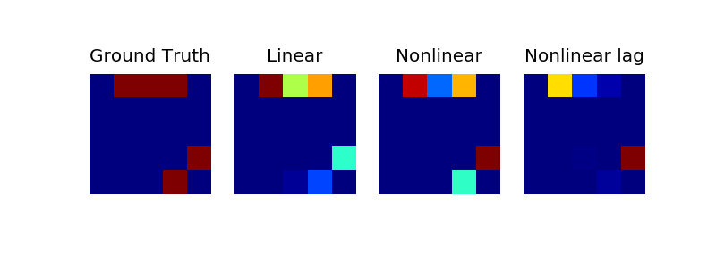

# RNN-GC

## Introduction
This is the official implementation of article "Estimating brain connectivity with varying-length time lags using a recurrent neural network (TBME 2018)". It automatically compute the directional brain connectivity from EEG, ECoG and LFP signals.

## Requirements: software
* Python 2.7 or 3.6
* Keras
* theano or tensorflow

## Testing Demo
run rnn_gc_demo.py

## Results

## Citing RNN-GC
If you find the toolbox is useful, please cite:
Wang Y, Lin K, Qi Y, et al. Estimating brain connectivity with varying-length time lags using a recurrent neural network[J]. IEEE Transactions on Biomedical Engineering, 2018, 65(9): 1953-1963.
